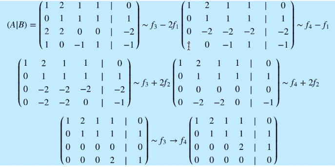
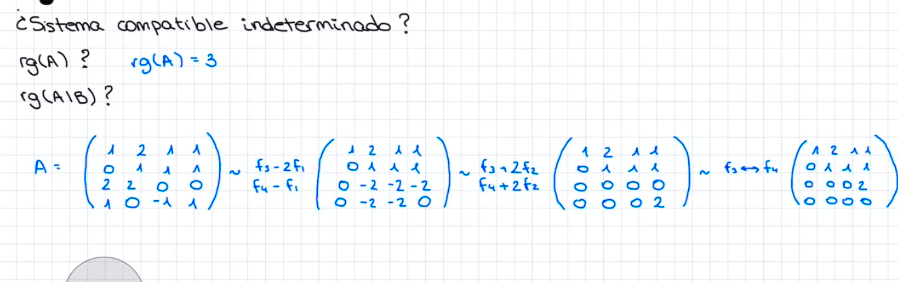
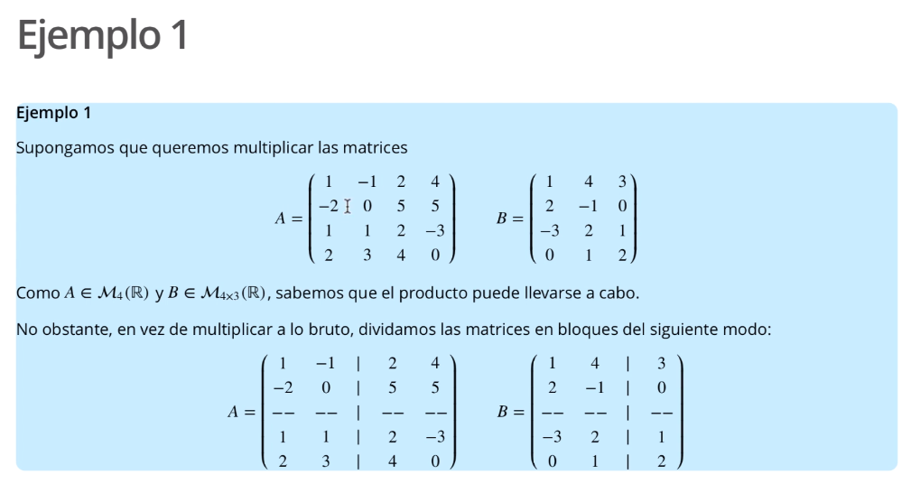
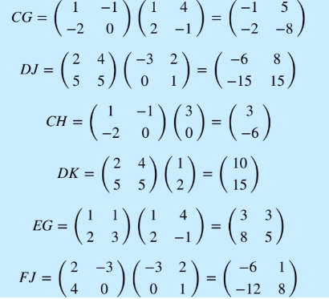
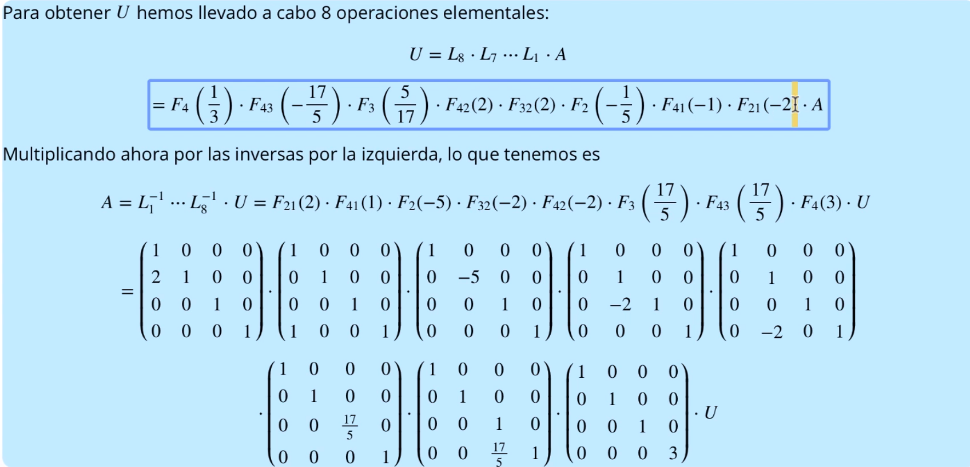
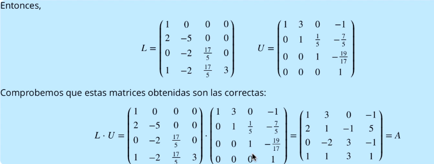
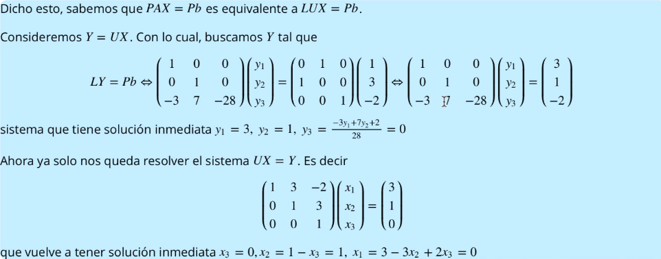

# Indice
- [Matrices](#matrices)
    - [Tipo de matrices](#tipo-de-matrices)
    - [Operaciones de matrices](#operaciones-de-matrices)
    - [Propiedades de matrices](#propiedades-de-matrices)
    - [Matriz traspuesta](#matriz-traspuesta)
    - [Propiedades Matriz Cuadrada](#propiedades-matriz-cuadrada)
    - [Matrices escalonadas](#matrices-escalonadas)
    - [Rango](#rango)
    - [Matriz Inversa](#matriz-inversa)
- [Ecuaciones lineales](#ecuaciones-lineales)
    - [Ecuaciones lineales](#ecuaciones-lineales)
    - [Metodo Gauss](#metodo-gauss)
- [Producto por bloques y Factorizacion](#producto-por-bloques-y-factorizacion)
    - [Producto por bloques](#producto-por-bloques)
    - [Factorizacion LU](#factorizacion-lu)
    - [Lu sin Permutacion](#lu-sin-permutacion)
    - [Lu con Permutacion](#lu-con-permutacion)
- [Determinantes](#determinantes)

# Matrices
**Octave es el mas preparado para trabajar con matrices**

                3
          [ a b c ]
    A = 2 [ d e f ]
          [ g h i ]   

    A23 = f

## Tipo de matrices

### Matriz Fila

     [ d e f ]

### Matriz Columna

    [ a ]
    [ d ]
    [ g ]

### Matriz Nula
Todos los cocientes son cero

    [ 0 0 0 ]
    [ 0 0 0 ]
    [ 0 0 0 ]   

### Matriz Cuadrada
Matriz de orden N, columnas coinciden con fila

     [ 0 c ]
     [ d f ] 

### Matriz Diagona
Tiene cero fuera de la diagonal principal

    [ x y y ]                   [ 1  0  0 ]
    [ y x y ]                   [ 0 -2  0 ]
    [ y y x ]                   [ 0  0  5 ]

    x = diagonal principal

### Matriz Escalar
Ademas de ser matriz diagonal, la diagonal principal tiene el mismo numero

         [ 7 0 0 ]
    A =  [ 0 7 0 ]
         [ 0 0 7 ]   

### Matriz Identidad
Ademas de ser matriz diagonal, la diagonal principal tiene **siempre 1**

         [ 1 0 0 ]
    A =  [ 0 1 0 ]
         [ 0 0 1 ]   

### Matriz Triangular Superior
Cero abajo de la diagonal ( no necesaiamente tiene que ser cuadradda)

         [ 1 3 1 4 ]
         [ 1 2 3 1 ]
    A =  [ 0 4 5 2 ]
         [ 0 0 1 3 ]
         [ 0 0 0 4 ]   

### Matriz Triangular Inferior
Cero arriba de la diagonal ( no necesaiamente tiene que ser cuadradda)

         [ 1 0 0 0 ]
         [ 1 2 0 0 ]
    A =  [ 4 4 5 0 ]
         [ 2 3 1 3 ]
         [ 1 2 3 4 ]   

## Operaciones de matrices

### Suma
Solo si ambas son del mismo orden

         [ 3  5 -2  0 ]         [ 1 -4  5  2 ] 
    A =  [ 0  1  2 -1 ]     B = [ 3  2 -4  6 ] 
         [ 3  2  7  4 ]         [ 1 -3 -5  0 ] 

           [ 3+1 5-4 3-2 2+0 ]     [ 4  1  3  2 ]
    A+B =  [ 0+3 2+3 2-4 6-1 ]  =  [ 3  3 -2  5 ]
           [ 3+1 2-3 7-5 4+0 ]     [ 4 -1  2  4 ]

### Producto de un escalar

    λA = (λ * Aij)MxN

                           [ 1 2 3 ]
    Dado Lambda = 3 y A =  [ 4 5 6 ]

              [  3  6  9 ]
    λA = 3A = [ 12 15 18 ]

### Producto con matrices
Numero de columnas de **A** tiene que coincidir con el numero de filas de **B**

                                  [  2  1  ]
         [ -1  2  3  1  ]         [  0  2  ]
    A =  [  3 -2  1  0  ]     B = [ -1  3  ]
                                  [  0  1  ] 

Multiplico **filas de A** por **columnas de B**

          [ -1*2+2*0+3*(-1)+1*0 -1*1+2*2+3*3+1*1 ]     [ -5 13  ]
    AB =  [  3*2-2*0+1*(-1)+0*0  3*1-2*2+1*3+0*1 ]  =  [  5  2  ]

### Traza
Suma de los elementos de la diagonal principal
 

 

&space;=&space;a_{11}&space;&plus;&space;a_{22}&space;&plus;&space;...&space;&plus;&space;a_{nn}&space;=&space;\sum_{i=1}^{n}) 

## Propiedades de matrices

### Conmutativa (Solo por SUMA)
    A + B = B + A

### Asociativa
    (A + B) + C = A + (B + C)

### Elemento Neutro de la suma
**Matriz nula** sumada con otra cualquiera da la propia matriz
    A + 0 = 0 + A = A

### Opuesta
    A + (-A) = (-A) + A = 0

 

### Asociativa
    (AB)C = A(BC)

### Distributiva
    A(B+C) = AB + AC

### Elemento Neutro o Unidad
Multiplicada por la Identidad 
 
 
 

### Excepciones
No se cumple la propiedad conmutativa (para producto, salvo en muy pocos casos) 
No se cumple la ley de simplificacion. 

    AB = AC => B <> C

Divisores de cero. El producto de que 2 matrices den cero, no implican que A o B sean cero 

## Matriz traspuesta
 

### Traspuesta de una suma

^{t}&space;=&space;A^{t}&space;&plus;&space;B^{t})  

^{t}=\sum_{i=1}^{r}A_{i}^{t}) 

### Traspuesta de un producto
^{t}&space;=&space;A^{t}B^{t}) 

## Propiedades Matriz Cuadrada

### Matriz Simetrica
A es simetrica si coincide con su traspuesta 

### Matriz Antisimetrica
A es antisimetrica si su traspuesta coincide con su opuesta 

### Regular
Matriz multiplicada por su inversa da la identidad, sino es una matriz **Singular** 

### Ortogonal
Es regular y ademas su inversa coincide con su traspuesta 

## Matrices escalonadas

### Escalonada Por fila
- El primer elemento no nulo de cada fila , denominado pivote, esta a la derecha del pivote de la fila superior.
- Las filas nulas estan en la parte inferior de la matriz
 
Este ejemplo tiene en el primero como pivote el 2, 1 y al final el 2 de la 4ta fila (porque hay un cero en la 3ra)  

### Escalonada Reducida por fila
- Los pivotes son todos 1s
- Todos los elementos que estan en la misma columna del pivote son nulos
 

## Rango
Se denomina rango de A y se denota como rg(A), al numero de filas no nulas que tienen su unica matriz escalonada por filas equivalentes 
 
Rango 3, porque tiene 3 filas y ninguna de ellas es todo cero  
Si tenemos una matriz no escalonada tenemos que hacerla escalonada, para saber su rango 
 

## Matriz Inversa
- A es una Matriz cuadrada
- A es invertible
- rg(A) = n (rango maximo, no te queda ninguna fila o columna en cero)
- La matriz escalonada reducida por filas equivale a A es la matriz identidad In 
Ejemplo de como calcular de inversa de una matriz 
 

# Ecuaciones lineales
 
Ecuaciones lineales, siempre de grado 1, solo un valor x 

### Sistema Homogeneo
Todas las ecuaciones son igual a cero }
 

### Forma Matricial
Todo sistema de ecuaciones lineales se puede escribir de forma matricial 
 

### Matriz Ampliada del sistema
 

### Teorema Rouche-Frobenius
 
 
 

### Sistemas Equivalentes
 

## Metodo Gauss
 

### Metodo Gauss - sistema compatible determinado
 
sumamos valores para que nos queden ceros en la primera fila  
 
 
 

### Metodo Gauss - sistema compatible indeterminado
 
 
 
 
 

# Producto por bloques y Factorizacion

## Producto por bloques
Multilicar matrices de orden elevado que tardarian mucho tiempo en procesarse, odemos dividir las matrices por bloques y realizar el producto por bloques entre la matriz A y B, 
en lugar de multiplicar filas y columnas voy a multiplicar bloques de matrices 
 
 
 
 
 
En realidad tiene sentido hacer esto cuando una de las matrices que divido es la identidad o la nula 
 
A, B o C por la Identidad me da A, B o C. Es como un 1 
Siempre vamos a tratar de tener bloques de 0 o Identidad en las matrices para que sean mas faciles de procesar 
 

## Factorizacion LU

¿Cuando una matriz puede escribisre como producto de una matriz triangular inferior (L) y triangular superior (U). 
 
 
 

### Lu sin Permutacion
 
 
Hasta ahora obtuvimos la U, ahora tenemos que obtener la L 
 
 

### Lu con Permutacion
 
 
 

 
 
 

# Determinantes

Solo para matrices cuadradas 
 
Para sacar alfa11 por ejemplo, tachamos la fila 1 y la columna 1, nos queda a22 
 

**Matriz orden 3** 
 
 
 
 